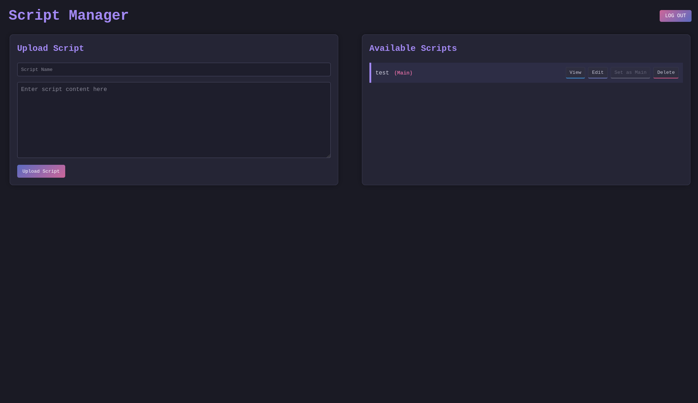

# Script downloader: A Basic HTTP Server for downloading scripts using the ATTiny 85



## Overview

This is a basic HTTP server that allows you to download scripts using the ATTiny 85 microcontroller.

## Features

- Download scripts from the server
- Upload scripts to the server
- Delete scripts from the server
- Update scripts on the server
- List all scripts on the server

## Usage

- Run the server: `node index.js`
- Upload a script: `curl -X POST http://localhost:3000/upload -H "Content-Type: application/json" -d '{"password": "password", "scriptName": "script.js", "scriptContent": "console.log('Hello, world!');"}'`
- Download a script: `curl http://localhost:3000/s/script.js`
- Delete a script: `curl -X DELETE http://localhost:3000/s/script.js`
- Update a script: `curl -X PUT http://localhost:3000/s/script.js -H "Content-Type: application/json" -d '{"password": "password", "scriptContent": "console.log('Hello, world!');"}'`

## Docker Usage

1.  **Build the Docker image:**
    ```bash
    docker build -t script-downloader .
    ```

2.  **Run the Docker container:**
    ```bash
    docker run -p 3000:3000 -d script-downloader
    ```
    This command maps port 3000 of the container to port 3000 on your host machine and runs the container in detached mode (`-d`).

Once the container is running, you can interact with the server using the same `curl` commands as listed in the "Usage" section, as the port `3000` is forwarded. For example:

- Download a script: `curl http://localhost:3000/s/script.js`


## Docs

### Upload a script

```bash
curl -X POST http://localhost:3000/upload -H "Content-Type: application/json" -d '{"password": "password", "scriptName": "script.js", "scriptContent": "console.log('Hello, world!');"}'
```


### Download a script

```bash
curl http://localhost:3000/s/script.js
```


### Delete a script

```bash
curl -X DELETE http://localhost:3000/s/script.js
```


### Update a script

```bash
curl -X PUT http://localhost:3000/s/script.js -H "Content-Type: application/json" -d '{"password": "password", "scriptContent": "console.log('Hello, world!');"}'
```

