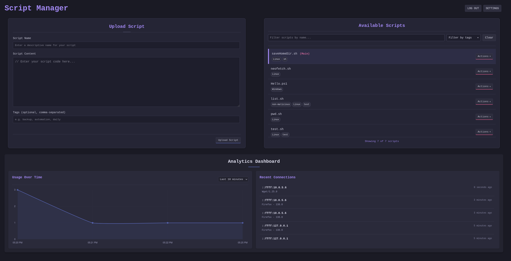

# Script Manager 📜✨



## Overview 🔍

Script Manager is a powerful web-based application that helps you organize, store, and manage your scripts. It provides a modern interface for script management with analytics capabilities and AI assistance.

## Features 🚀

- **Script Management**
  - 📥 Upload scripts to your personal repository
  - 📤 Download scripts to any device
  - 🔄 Update existing scripts with new versions
  - 🏷️ Tag scripts for better organization
  - 🔍 Search and filter scripts

- **Security**
  - 🔐 Password-protected access
  - 🔒 Secure API endpoints
  - 👤 User authentication

- **Analytics**
  - 📊 Track script usage over time
  - 📈 Monitor connections and downloads
  - 📆 Filter data by various time periods

- **AI Assistant**
  - 🤖 Get help with your scripts
  - 💡 Generate script content with AI
  - 🔧 Troubleshoot and debug issues

## Installation 🛠️

### Prerequisites

- Node.js (v14 or later)
- npm or Bun package manager

### Installation Steps

1. **Clone the repository:**
   ```bash
   git clone https://github.com/yourusername/script-manager.git
   cd script-manager
   ```

2. **Install dependencies:**
   ```bash
   npm install
   # or if using Bun
   bun install
   ```

3. **Create a .env file:**
   ```
   PASSWORD=your_secure_password
   # Optional: OpenAI API key for AI features
   OPENAI_API_KEY=your_openai_api_key
   ```

4. **Start the server:**
   ```bash
   npm start
   # or if using Bun
   bun start
   ```

5. **Access the application:**
   Open your browser and navigate to `http://localhost:8080`

## Docker Usage 🐳

1. **Build the Docker image:**
   ```bash
   docker build -t script-manager .
   ```

2. **Run the Docker container:**
   ```bash
   docker run -p 8080:8080 -d script-manager
   ```

## Usage Guide 📖

### Web Interface

1. **Login** with your password
2. **Upload scripts** using the upload form
3. **Manage scripts** from the available scripts list
4. **Download scripts** when needed
5. **Add tags** to organize your scripts
6. **View analytics** to track usage
7. **Adjust settings** to customize your experience

### API Usage

The application provides a RESTful API for programmatic access:

#### Upload a script

```bash
curl -X POST http://localhost:8080/upload \
  -H "Content-Type: application/json" \
  -d '{"password": "your_password", "scriptName": "script.js", "scriptContent": "console.log(\"Hello, world!\");"}'
```

#### Download a script

```bash
curl http://localhost:8080/s/script.js
```

#### Delete a script

```bash
curl -X DELETE http://localhost:8080/s/script.js \
  -H "Content-Type: application/json" \
  -d '{"password": "your_password"}'
```

#### Update a script

```bash
curl -X PUT http://localhost:8080/s/script.js \
  -H "Content-Type: application/json" \
  -d '{"password": "your_password", "scriptContent": "console.log(\"Updated script!\");"}'
```

## Analytics Dashboard 📊

The analytics dashboard provides insights into:

- Script usage over time
- Recent connections
- User agents
- Time-based trends

Filter the data by different time periods: last 10 minutes, hour, day, week, or month.

## Contributing 🤝

Contributions are welcome! Please feel free to submit a Pull Request.

## License 📄

This project is licensed under the MIT License with Commons Clause - see the [LICENSE](LICENSE) file for details.
